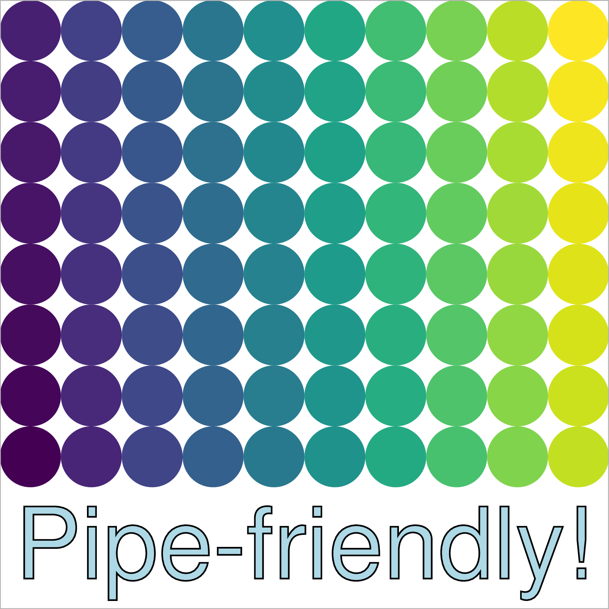

---
output: github_document
---

<!-- README.md is generated from README.Rmd. Please edit that file -->

```{r, include = FALSE}
knitr::opts_chunk$set(
  collapse = TRUE,
  comment = "#>",
  fig.path = "man/figures/README-",
  out.width = "75%"
)

suppressPackageStartupMessages({
  library(dplyr)
  library(glue)
  library(minipdf)
})
```
# minipdf 

<!-- badges: start -->

[](https://travis-ci.org/coolbutuseless/minipdf)
<!-- badges: end -->

`minipdf` is a package for creating simple, single-page PDF documents written in pure R.

This package is very, very far from supporting the full [PDF spec](https://www.adobe.com/devnet/pdf/pdf_reference.html) 
(which is over 750 pages!), but it supports enough to draw simple figures - for
example the package logo was created with the package itself.


#### Supported features

* Documents with a single page only
* Only one font per document (set during initialization)
* Objects: Text, lines, polylines, polygons, rectangles and circles
* Attributes: Fill colour (including alpha), stroke colour (including alpha), linewidth, linetype
* Clipping regions

Currently there is no support for annotations or any sort of text layout.


## What's in the box

* `PDFDocument` 
    - an R6 class for building a PDF document
    - object methods: `add_line()`, `add_rect()`, `add_polyline()`, `add_polygon()`, `add_text()`,
      `add_circle()`, 
    - other methods: `set_clip_rect()`, `write_pdf()`
* A suite of functions that wrap the R6 class for easier use with a pipe.


## Installation

You can install the development version from [GitHub](https://github.com/coolbutuseless/minipdf) with:

``` r
# install.packages("devtools")
devtools::install_github("coolbutuseless/minipdf")
```

## Future possibilities

* Better text handling (multiple fonts per document)
* Annotations


## Shoulders of Giants

* [R6 authors](https://cran.r-project.org/package=R6) for putting together such an intuitive OO system for R
* [Raphael Sonabend](https://twitter.com/RaphaelS101) for writing the [R62S3](https://cran.r-project.org/package=R62S3) package - this package automatically creates wrappers for R6 methods so that they be called as regular functions. I've re-implemented a cut-down version of `R62S3::R62Fun()` as part of `minipdf`


## References

* [PDF specification document](https://www.adobe.com/devnet/pdf/pdf_reference.html)
* [PDF: An Introduction for Programmers](http://preserve.mactech.com/articles/mactech/Vol.15/15.09/PDFIntro/index.html)
* [Make your own PDF file](https://blog.idrsolutions.com/2010/09/grow-your-own-pdf-file-part-1-pdf-objects-and-data-types/)


## Creating a simple PDF with the R6 interface

```{r}
#~~~~~~~~~~~~~~~~~~~~~~~~~~~~~~~~~~~~~~~~~~~~~~~~~~~~~~~~~~~~~~~~~~~~~~~~~~~~~~
# Initialise the document
# Draw a pretty geometric pattern
#~~~~~~~~~~~~~~~~~~~~~~~~~~~~~~~~~~~~~~~~~~~~~~~~~~~~~~~~~~~~~~~~~~~~~~~~~~~~~~
pdfdoc <- minipdf::PDFDocument$new(width = 400, height = 400)

for (i in seq(0, 400, 20)) {
  pdfdoc$add_line(i    ,     0,   400,     i, stroke = '#00000020')
  pdfdoc$add_line(400  ,     i, 400-i,   400, stroke = '#00000020')
  pdfdoc$add_line(400-i,   400,     0, 400-i, stroke = '#00000020')
  pdfdoc$add_line(0    , 400-i,     i,     0, stroke = '#00000020')
}

#~~~~~~~~~~~~~~~~~~~~~~~~~~~~~~~~~~~~~~~~~~~~~~~~~~~~~~~~~~~~~~~~~~~~~~~~~~~~~~
# Draw a circle in the centre with some text around
#~~~~~~~~~~~~~~~~~~~~~~~~~~~~~~~~~~~~~~~~~~~~~~~~~~~~~~~~~~~~~~~~~~~~~~~~~~~~~~
pdfdoc$add_circle(200, 200, 50, fill = "#12345680", stroke = NULL)

ncolours <- 40
pal <- rainbow(ncolours)
for (i in seq(ncolours)) {
  pdfdoc$add_text("                        #Rstats", x = 200, y = 200, 
                  angle = (1 - i)/ncolours * 360, fill = pal[i])
}

#~~~~~~~~~~~~~~~~~~~~~~~~~~~~~~~~~~~~~~~~~~~~~~~~~~~~~~~~~~~~~~~~~~~~~~~~~~~~~~
# Write the PDF to file
#~~~~~~~~~~~~~~~~~~~~~~~~~~~~~~~~~~~~~~~~~~~~~~~~~~~~~~~~~~~~~~~~~~~~~~~~~~~~~~
pdfdoc$write_pdf("man/figures/example1.pdf")
```


```{r include = FALSE}
system("convert -density 300 man/figures/example1.pdf -resize 100% man/figures/example1.png")
```

```{r echo = FALSE}
knitr::include_graphics("man/figures/example1.png")
```


## Creating a simple PDF with the pipe-compatible functions

For those more used to working with pipes, there are pipe-friendly versions of
most methods.  These all take the R6 `PDFDocument` class as their first argument.

```{r}
pdfdoc <- create_pdfdoc(width = 400, height = 400, font = 'Helvetica-Bold')

pal <- viridisLite::viridis(80)
i   <- 0
for (x in seq(20, 400, 40)) {
  for (y in seq(100, 400, 40)) {
    i <- i + 1
    pdfdoc <- pdfdoc %>% 
      add_circle(x, y, r = 20, fill = pal[i])
  }
}

pdfdoc <- pdfdoc %>%
  add_text("Pipe-friendly!", x = 10, y = 20, size = 65, stroke = 'grey50', fill = 'lightblue', text_mode = 2) %>%
  add_rect(0, 0, 400, 400, fill = NULL, stroke = 'grey70')

pdfdoc %>% write_pdf("man/figures/example-pipe.pdf")
```


```{r include = FALSE}
system("convert -density 300 man/figures/example-pipe.pdf -resize 100% man/figures/example-pipe.png")
```

```{r echo = FALSE}

```


## Creating the logo for this package

* Design inspiration: the whole decade of the 1970s.

```{r}
#~~~~~~~~~~~~~~~~~~~~~~~~~~~~~~~~~~~~~~~~~~~~~~~~~~~~~~~~~~~~~~~~~~~~~~~~~~~~~~
# Create the hexagonal clipping path
#~~~~~~~~~~~~~~~~~~~~~~~~~~~~~~~~~~~~~~~~~~~~~~~~~~~~~~~~~~~~~~~~~~~~~~~~~~~~~~
spacing <- 200
w <- sqrt(3) * spacing
h <- 2       * spacing

qh <- h/4
hw <- w/2

path <- glue("
{hw} {     0} m
{ 0} {    qh} l
{ 0} {3 * qh} l
{hw} {4 * qh} l
{ w} {3 * qh} l
{ w} {    qh} l
{hw} {     0} l
")


#~~~~~~~~~~~~~~~~~~~~~~~~~~~~~~~~~~~~~~~~~~~~~~~~~~~~~~~~~~~~~~~~~~~~~~~~~~~~~~
# Setup circles
#~~~~~~~~~~~~~~~~~~~~~~~~~~~~~~~~~~~~~~~~~~~~~~~~~~~~~~~~~~~~~~~~~~~~~~~~~~~~~~
o1 <- 80
o2 <- 60
o3 <- 40
o4 <- 30

#~~~~~~~~~~~~~~~~~~~~~~~~~~~~~~~~~~~~~~~~~~~~~~~~~~~~~~~~~~~~~~~~~~~~~~~~~~~~~~
# Create the PDF document with hexagonal clipping path
#~~~~~~~~~~~~~~~~~~~~~~~~~~~~~~~~~~~~~~~~~~~~~~~~~~~~~~~~~~~~~~~~~~~~~~~~~~~~~~
pdfdoc <- PDFDocument$new(width = w, height = h, font = 'Courier-Bold')
pdfdoc$add_clip_stream(clip_path = path)

#~~~~~~~~~~~~~~~~~~~~~~~~~~~~~~~~~~~~~~~~~~~~~~~~~~~~~~~~~~~~~~~~~~~~~~~~~~~~~~
# Solid Background colour
#~~~~~~~~~~~~~~~~~~~~~~~~~~~~~~~~~~~~~~~~~~~~~~~~~~~~~~~~~~~~~~~~~~~~~~~~~~~~~~
pdfdoc$add_rect(0, 0, w, h, fill = "#A84128", stroke = NULL)

#~~~~~~~~~~~~~~~~~~~~~~~~~~~~~~~~~~~~~~~~~~~~~~~~~~~~~~~~~~~~~~~~~~~~~~~~~~~~~~
# Circles. Lots of circles
#~~~~~~~~~~~~~~~~~~~~~~~~~~~~~~~~~~~~~~~~~~~~~~~~~~~~~~~~~~~~~~~~~~~~~~~~~~~~~~
pdfdoc$add_circle(x = hw + o1, y = 2*qh + o1, r = o1    , fill = '#f8b918', stroke = NULL)
pdfdoc$add_circle(x = hw + o1, y = 2*qh - o1, r = o1    , fill = '#f8b918', stroke = NULL)
pdfdoc$add_circle(x = hw - o1, y = 2*qh + o1, r = o1    , fill = '#f8b918', stroke = NULL)
pdfdoc$add_circle(x = hw - o1, y = 2*qh - o1, r = o1    , fill = '#f8b918', stroke = NULL)

pdfdoc$add_circle(x = hw + o2, y = 2*qh + o2, r = o2-8.5, fill = '#ee9421', stroke = NULL)
pdfdoc$add_circle(x = hw + o2, y = 2*qh - o2, r = o2-8.5, fill = '#ee9421', stroke = NULL)
pdfdoc$add_circle(x = hw - o2, y = 2*qh + o2, r = o2-8.5, fill = '#ee9421', stroke = NULL)
pdfdoc$add_circle(x = hw - o2, y = 2*qh - o2, r = o2-8.5, fill = '#ee9421', stroke = NULL)

pdfdoc$add_circle(x = hw + o3, y = 2*qh + o3, r = o3-17 , fill = '#e75920', stroke = NULL)
pdfdoc$add_circle(x = hw + o3, y = 2*qh - o3, r = o3-17 , fill = '#e75920', stroke = NULL)
pdfdoc$add_circle(x = hw - o3, y = 2*qh + o3, r = o3-17 , fill = '#e75920', stroke = NULL)
pdfdoc$add_circle(x = hw - o3, y = 2*qh - o3, r = o3-17 , fill = '#e75920', stroke = NULL)

pdfdoc$add_circle(x = hw + o4, y = 2*qh + o4, r = 10    , fill = '#Af2a33', stroke = NULL)
pdfdoc$add_circle(x = hw + o4, y = 2*qh - o4, r = 10    , fill = '#Af2a33', stroke = NULL)
pdfdoc$add_circle(x = hw - o4, y = 2*qh + o4, r = 10    , fill = '#Af2a33', stroke = NULL)
pdfdoc$add_circle(x = hw - o4, y = 2*qh - o4, r = 10    , fill = '#Af2a33', stroke = NULL)

#~~~~~~~~~~~~~~~~~~~~~~~~~~~~~~~~~~~~~~~~~~~~~~~~~~~~~~~~~~~~~~~~~~~~~~~~~~~~~~
# Label
#~~~~~~~~~~~~~~~~~~~~~~~~~~~~~~~~~~~~~~~~~~~~~~~~~~~~~~~~~~~~~~~~~~~~~~~~~~~~~~
pdfdoc$add_text("minipdf", x = hw+5, y = 15, fill = '#ffffff', size = 44, angle = 30)

#~~~~~~~~~~~~~~~~~~~~~~~~~~~~~~~~~~~~~~~~~~~~~~~~~~~~~~~~~~~~~~~~~~~~~~~~~~~~~~
# Write the PDF to file
#~~~~~~~~~~~~~~~~~~~~~~~~~~~~~~~~~~~~~~~~~~~~~~~~~~~~~~~~~~~~~~~~~~~~~~~~~~~~~~
pdfdoc$write_pdf("man/figures/logo.pdf")
```


```{r include = FALSE}
system("convert -density 300 man/figures/logo.pdf -resize 100% man/figures/logo.png")
```

```{r echo = FALSE}
knitr::include_graphics("man/figures/logo.png")
```


