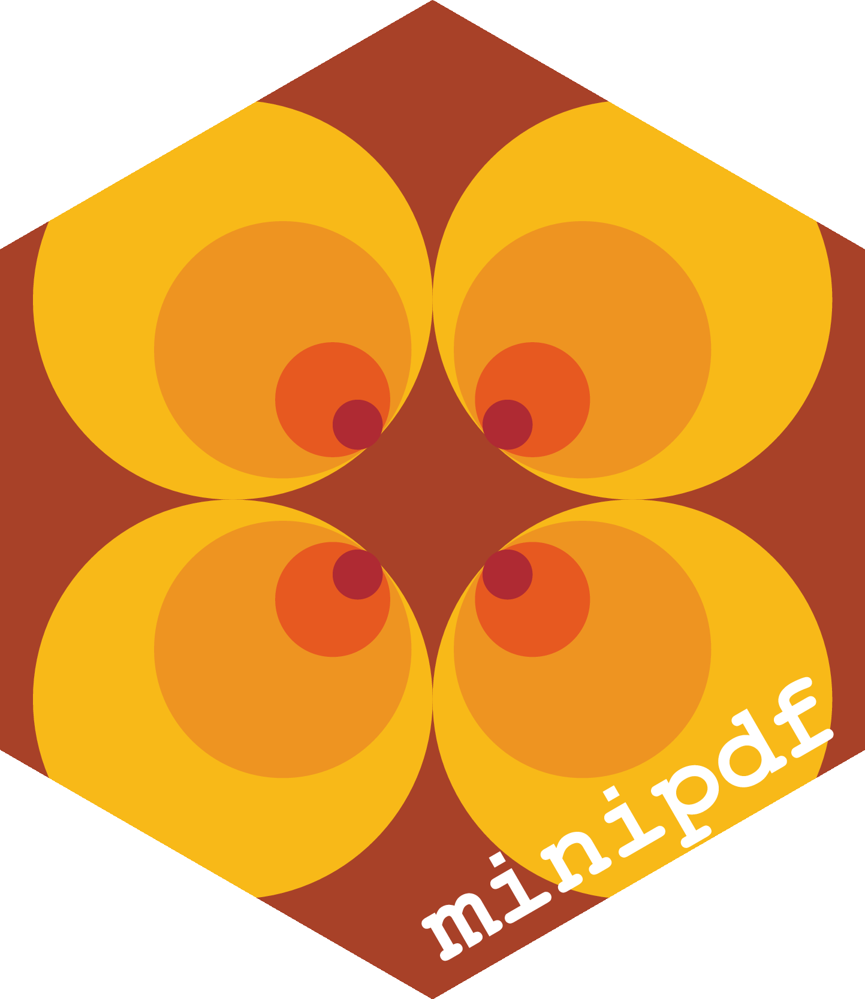
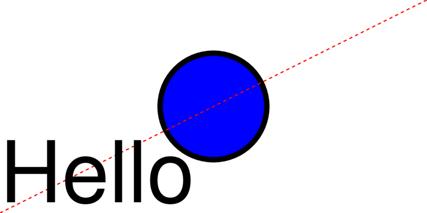
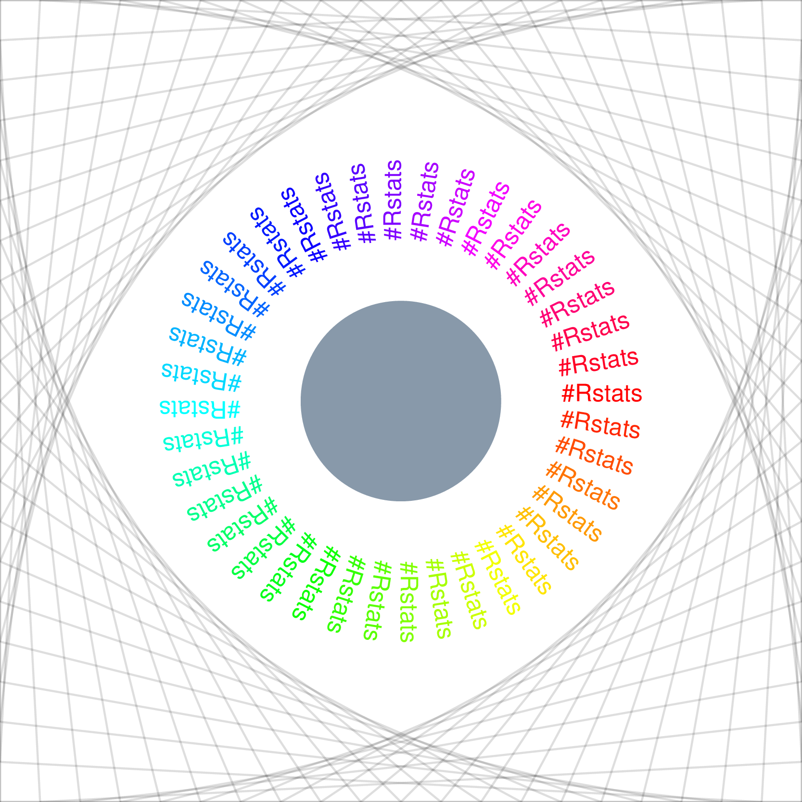

<!-- README.md is generated from README.Rmd. Please edit that file -->

# minipdf 

<!-- badges: start -->


[](https://github.com/coolbutuseless/minipdf/actions/workflows/R-CMD-check.yaml)
<!-- badges: end -->

`minipdf` is a package for creating simple PDF documents.

## Installation

You can install the development version from
[GitHub](https://github.com/coolbutuseless/minipdf) with:

``` r
# install.packages("devtools")
devtools::install_github("coolbutuseless/minipdf")
```

## Simple Example

``` r
doc <- create_pdf(width = 400, height = 200) |>
  pdf_circle(200, 100, r = 50, col = 'black', lwd = 5, fill = 'blue') |> 
  pdf_line(0, 0, 400, 200, lty = 2, col = 'red') |> 
  pdf_text("Hello", 0, 10, fontsize = 80)


write_pdf(doc, "man/figures/simple.pdf")
```



``` r
write_pdf(doc) |> cat()
#> %PDF-1.7
#> 1 0 obj
#> <<
#>   /Creator (minipdf/R)
#>   /CreationDate (D:202508150623)
#> >>
#> endobj
#> 2 0 obj
#> <<
#>   /Type /Catalog
#>   /Pages 3 0 R
#> >>
#> endobj
#> 3 0 obj
#> <<
#>   /Type /Pages
#>   /Resources 4 0 R
#>   /MediaBox [0 0 400 200]
#>   /Kids [ 5 0 R ]
#>   /Count 1
#> >>
#> endobj
#> 4 0 obj
#> <<
#>   /ExtGState
#>   <<
#>     /GS1
#>     <<
#>       /CA 1
#>       /ca 1
#>     >>
#>   >>
#>   /Font
#>   <<
#>     /F1
#>     <<
#>       /Type /Font
#>       /Subtype /Type1
#>       /BaseFont /Helvetica
#>     >>
#>     /F2
#>     <<
#>       /Type /Font
#>       /Subtype /Type1
#>       /BaseFont /Helvetica-Bold
#>     >>
#>     /F3
#>     <<
#>       /Type /Font
#>       /Subtype /Type1
#>       /BaseFont /Helvetica-Oblique
#>     >>
#>     /F4
#>     <<
#>       /Type /Font
#>       /Subtype /Type1
#>       /BaseFont /Helvetica-BoldOblique
#>     >>
#>     /F5
#>     <<
#>       /Type /Font
#>       /Subtype /Type1
#>       /BaseFont /Courier
#>     >>
#>     /F6
#>     <<
#>       /Type /Font
#>       /Subtype /Type1
#>       /BaseFont /Courier-Bold
#>     >>
#>     /F7
#>     <<
#>       /Type /Font
#>       /Subtype /Type1
#>       /BaseFont /Courier-Oblique
#>     >>
#>     /F8
#>     <<
#>       /Type /Font
#>       /Subtype /Type1
#>       /BaseFont /Courier-BoldOblique
#>     >>
#>     /F9
#>     <<
#>       /Type /Font
#>       /Subtype /Type1
#>       /BaseFont /Times-Roman
#>     >>
#>     /F10
#>     <<
#>       /Type /Font
#>       /Subtype /Type1
#>       /BaseFont /Times-Bold
#>     >>
#>     /F11
#>     <<
#>       /Type /Font
#>       /Subtype /Type1
#>       /BaseFont /Times-Italic
#>     >>
#>     /F12
#>     <<
#>       /Type /Font
#>       /Subtype /Type1
#>       /BaseFont /Times-BoldItalic
#>     >>
#>     /F13
#>     <<
#>       /Type /Font
#>       /Subtype /Type1
#>       /BaseFont /Symbol
#>     >>
#>     /F14
#>     <<
#>       /Type /Font
#>       /Subtype /Type1
#>       /BaseFont /ZapfDingbats
#>     >>
#>   >>
#> >>
#> endobj
#> 5 0 obj
#> <<
#>   /Type /Page
#>   /Parent 3 0 R
#>   /Contents [6 0 R 7 0 R 8 0 R 9 0 R]
#> >>
#> endobj
#> 6 0 obj
#> <<
#>   /Length 37
#> >>
#> stream
#> 0 0 400 200 re W n
#> 0 0 400 200 re W n
#> endstream
#> endobj
#> 7 0 obj
#> <<
#>   /Length 248
#> >>
#> stream
#> q
#> 0 0 0 RG
#> 0 0 1 rg
#> 5 w
#> 250 100 m
#> 250 127.61423749155  227.61423749155 150  200   150 c
#> 172.38576250845 150  150 127.61423749155  150 100   c
#> 150 72.38576250845  172.38576250845 50  200   50 c
#> 227.61423749155 50  250 72.38576250845  250 100   c
#> b
#> Q
#> endstream
#> endobj
#> 8 0 obj
#> <<
#>   /Length 47
#> >>
#> stream
#> q
#> 1 0 0 RG
#> 0 0 0 rg
#> [3] 0 d
#> 0 0 m 400 200 l S
#> Q
#> endstream
#> endobj
#> 9 0 obj
#> <<
#>   /Length 61
#> >>
#> stream
#> q
#> 0 0 0 RG
#> 0 0 0 rg
#> BT
#> /F1 80 Tf
#> 0 10 Td
#> 0 Tr
#> (Hello) Tj
#> ET
#> Q
#> endstream
#> endobj
#> xref
#> 0 10
#> 0000000000 65535 f
#> 0000000009 00000 n
#> 0000000086 00000 n
#> 0000000139 00000 n
#> 0000000249 00000 n
#> 0000001664 00000 n
#> 0000001753 00000 n
#> 0000001842 00000 n
#> 0000002143 00000 n
#> 0000002242 00000 n
#> trailer 
#> <<
#>   /Size 10
#>   /Info 1 0 R
#>   /Root 2 0 R
#> >>
#> startxref
#> 2355
#> %%EOF
```

## `Hello-world.pdf`

``` r
doc <- create_pdf(height = 400, width = 600)

N <- 400
xs <- sample(600, N, TRUE)
ys <- sample(400, N, TRUE)
rs <- sample(100, N, TRUE)
cs <- sample(colors(), N, TRUE)

for (i in seq_len(N)) {
  doc <- pdf_circle(doc, xs[i], ys[i], rs[i], col = NA, fill = cs[i], alpha = 0.2)
}

doc <- pdf_translate(doc, 50, 0)

doc <- pdf_text(doc, "#RStats", 10, 150, fontsize = 120, mode = 1, col = 'black', 
                fontface = 'bold.italic', lwd = 5)


#~~~~~~~~~~~~~~~~~~~~~~~~~~~~~~~~~~~~~~~~~~~~~~~~~~~~~~~~~~~~~~~~~~~~~~~~~~~~
# 
#~~~~~~~~~~~~~~~~~~~~~~~~~~~~~~~~~~~~~~~~~~~~~~~~~~~~~~~~~~~~~~~~~~~~~~~~~~~~
write_pdf(doc, "man/figures/example1.pdf")
```



## References

- [PDF specification
  document](https://www.adobe.com/devnet/pdf/pdf_reference.html)
- [PDF: An Introduction for
  Programmers](http://preserve.mactech.com/articles/mactech/Vol.15/15.09/PDFIntro/index.html)
- [Make your own PDF
  file](https://blog.idrsolutions.com/2010/09/grow-your-own-pdf-file-part-1-pdf-objects-and-data-types/)
