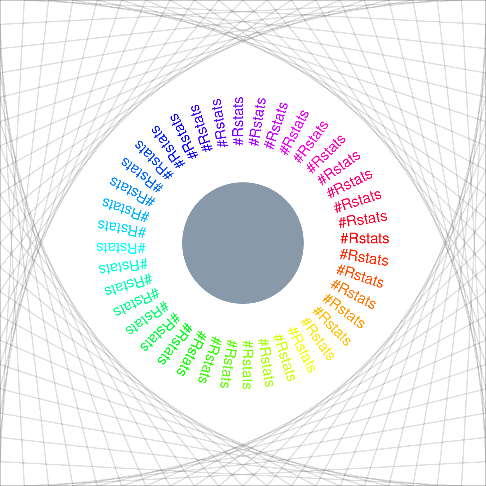
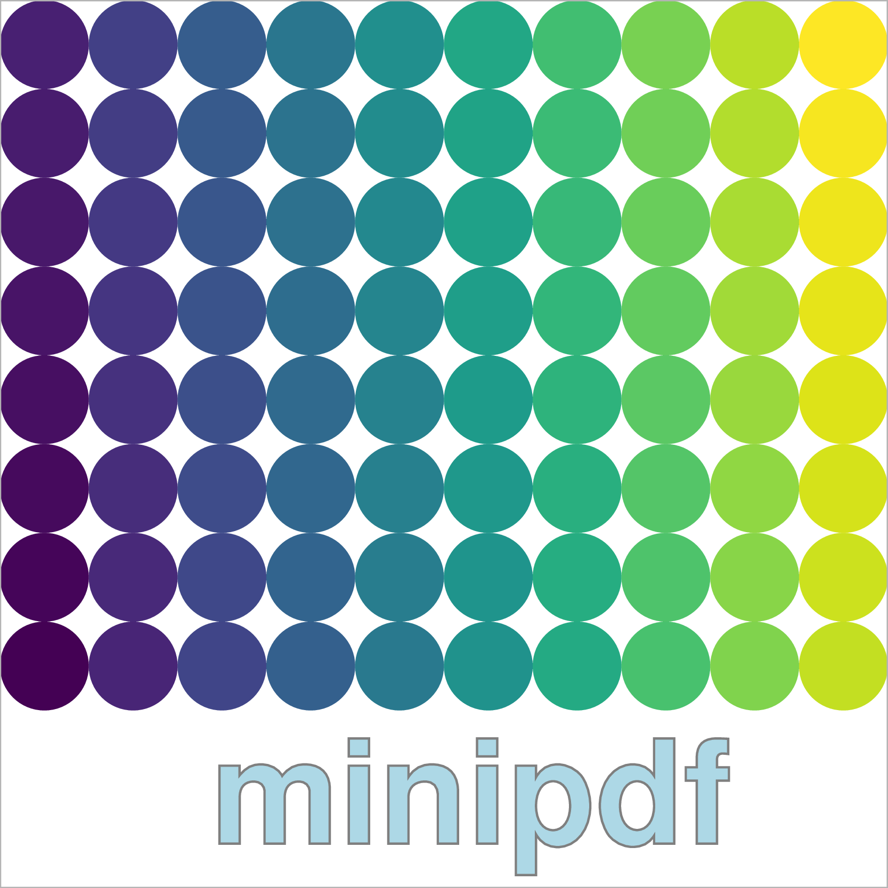
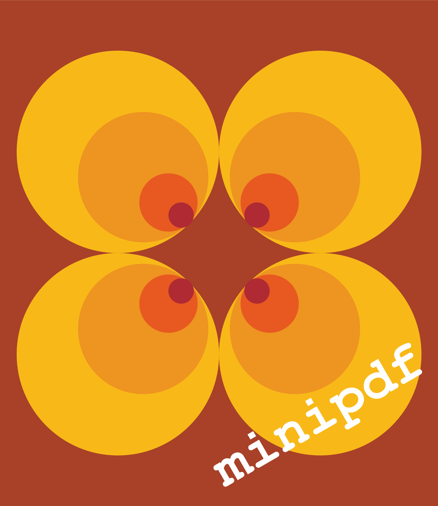

<!-- README.md is generated from README.Rmd. Please edit that file -->

# minipdf 

<!-- badges: start -->


 [](https://travis-ci.org/coolbutuseless/minipdf)
<!-- badges: end -->

`minipdf` is a package for creating simple, single-page PDF documents.

## Installation

You can install the development version from
[GitHub](https://github.com/coolbutuseless/minipdf) with:

``` r
# install.packages("devtools")
devtools::install_github("coolbutuseless/minipdf")
```

See the online documentation
[here](https://coolbutuseless.github.io/package/minipdf/index.html)
(thanks to
[pkgdown](https://cran.r-project.org/package=pkgdown))

## `Hello-world.pdf`

``` r
doc <- PDFDocument$new(width = 200, height = 60, fontname = 'Helvetica-Bold')
doc$rect(0, 0, 200, 60, fill = '#123456', stroke = NULL)
doc$text("Hello World!", x = 10, y = 15, fontsize = 20, fill = 'white')
doc$line(0, 10, 200, 10, stroke = 'grey80')
doc$save("man/figures/helloworld.pdf")
```


## Creating geometric patterns

By copying and modifying/transforming a basic shape (e.g. a diamond)
complex patterns can be built.

``` r
xs <- c(0, 75, 150, 75, 0)
ys <- c(0, -50, 0, 50, 0)
diamond <- PDFPolygon$new(xs = xs, ys = ys, stroke = NULL)
d1a <- diamond$copy()$fill('darkred')$translate(  0,  50)
d1b <- diamond$copy()$fill('#123456')$translate(150,  50)
d1c <- diamond$copy()$fill('darkred')$translate(300,  50)
d2a <- diamond$copy()$fill('#123456')$translate(  0, 150)
d2b <- diamond$copy()$fill('darkred')$translate(150, 150)
d2c <- diamond$copy()$fill('#123456')$translate(300, 150)
d3  <- diamond$copy()$fill('#12345630')$
  stroke('white')$
  linewidth(2)$
  translate(75, 100)$scale(2)
doc <- pdfdoc(width = 450, height = 200, d1a, d1b, d1c, d2a, d2b, d2c, d3)
doc$save("man/figures/diamonds.pdf")
```


## Supported features

  - Documents with a single page only
  - Only one font per document (set during initialization)
  - Objects: Text, lines, polylines, polygons, rectangles and circles
  - Attributes: Fill colour (including alpha), stroke colour (including
    alpha), linewidth, linetype
  - Clipping regions - per object clipping region as well as the global
    document clipping region.

Currently there is no support for annotations or any sort of text
layout.

## News

  - `minipdf v0.2.1` and `minidf v0.2.2`
      - transforms are now methods on the PDF stream objects
      - renamed methods on the PDFDcoument e.g. `add_rect()` is now just
        `rect()`
      - internal refactoring of attribute handling.

## Gallery

<div>






</div>

## References

  - [PDF specification
    document](https://www.adobe.com/devnet/pdf/pdf_reference.html)
  - [PDF: An Introduction for
    Programmers](http://preserve.mactech.com/articles/mactech/Vol.15/15.09/PDFIntro/index.html)
  - [Make your own PDF
    file](https://blog.idrsolutions.com/2010/09/grow-your-own-pdf-file-part-1-pdf-objects-and-data-types/)
