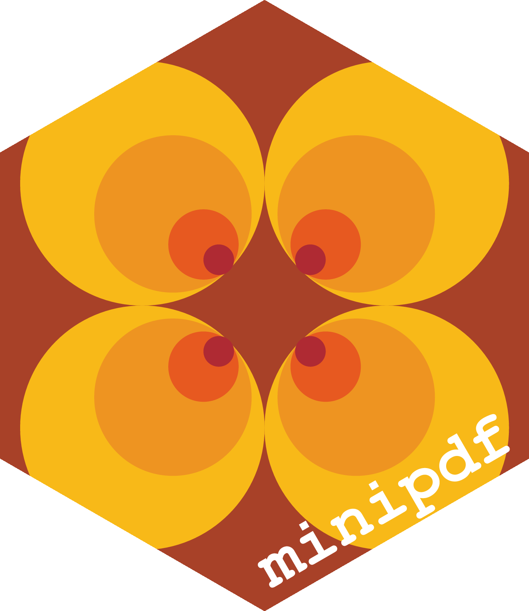
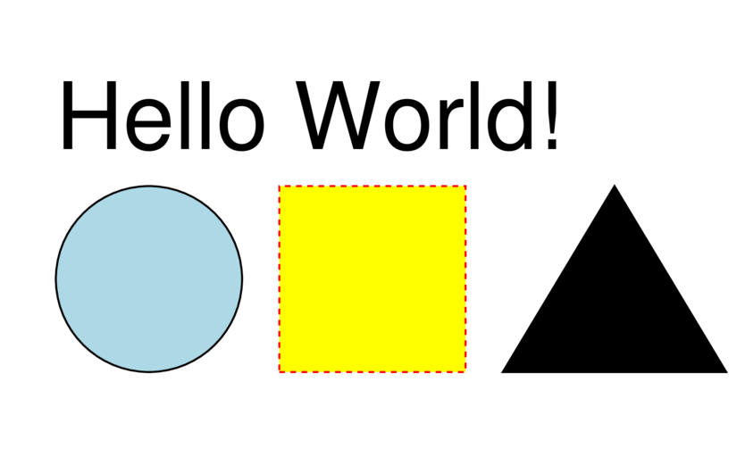
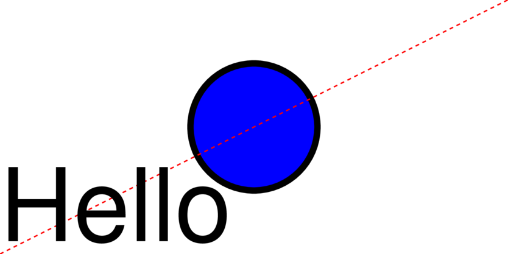

<!-- README.md is generated from README.Rmd. Please edit that file -->

# minipdf 

<!-- badges: start -->


[](https://github.com/coolbutuseless/minipdf/actions/workflows/R-CMD-check.yaml)
<!-- badges: end -->

`minipdf` is a package for creating simple PDF documents.

### What’s in the box

- `create_pdf()` to create an empty PDF document
- `write_pdf()` to write a PDF to file or string
- `pdf_line()`, `pdf_rect()`, `pdf_circle()`, `pdf_polygon()`,
  `pdf_polyline()`, `pdf_text()`, `pdf_bezier()`, `pdf_image()` -
  functions for adding graphical elements to the PDF
- `pdf_clip_polygon()`, `pdf_clip_rect()` define global clipping regions
- `clip_polygon()`, `clip_rect()` define per-element clipping regions
- `pdf_rotate()`, `pdf_translate()`, `pdf_scale()` define global
  transformations
- `tf_rotate()`, `tf_translate()`, `tf_scale()` define per-element
  transformations
- `pgpar()` define PDF graphical parameters
- `pdf_newpage()` begin a new page in the PDF

## Installation

You can install the development version from
[GitHub](https://github.com/coolbutuseless/minipdf) with:

``` r
# install.packages("devtools")
devtools::install_github("coolbutuseless/minipdf")
```

# Hello World!

``` r
doc <- create_pdf(width = 400, height = 250) |>
  pdf_circle(80, 100, 50, fill = 'lightblue', col = 'black') |>
  pdf_rect(150, 50, 100, 100, fill = 'yellow', col = 'red', lty = 2) |> 
  pdf_polygon(c(270, 390, 330), c(50, 50, 150)) |>
  pdf_text("Hello World!", x = 30, y = 170, fontsize = 50)
```

``` r
write_pdf(doc, "man/figures/helloworld.pdf")
```



In `write_pdf()` if the output filename is not specified, then the
function returns the PDF document as a string

``` r
write_pdf(doc) |> cat()
```

    %PDF-1.7
    1 0 obj
    <<
      /Creator (minipdf/R)
      /CreationDate (D:202508230942)
    >>
    endobj
    2 0 obj
    <<
      /Type /Catalog
      /Pages 3 0 R
    >>
    endobj
    3 0 obj
    <<
      /Type /Pages
      /Resources 4 0 R
      /MediaBox [0 0 400 250]
      /Kids [ 5 0 R ]
      /Count 1
    >>
    endobj
    4 0 obj
    <<
      /ExtGState
      <<
        /GS1
        <<
          /CA 1
          /ca 1
        >>
      >>
      /Font
      <<
        /F1
        <<
          /Type /Font
          /Subtype /Type1
          /BaseFont /Helvetica
        >>
      >>
    >>
    endobj
    5 0 obj
    <<
      /Type /Page
      /Parent 3 0 R
      /Contents [6 0 R 7 0 R 8 0 R 9 0 R 10 0 R]
    >>
    endobj
    6 0 obj
    <<
      /Length 37
    >>
    stream
    0 0 400 250 re W n
    0 0 400 250 re W n
    endstream
    endobj
    7 0 obj
    <<
      /Length 284
    >>
    stream
    q
    0 0 0 RG
    0.67843137254902 0.847058823529412 0.901960784313726 rg
    130 100 m
    130 127.61423749155  107.61423749155 150  80   150 c
    52.38576250845 150  30 127.61423749155  30 100   c
    30 72.38576250845  52.38576250845 50  80   50 c
    107.61423749155 50  130 72.38576250845  130 100   c
    b
    Q
    endstream
    endobj
    8 0 obj
    <<
      /Length 49
    >>
    stream
    q
    1 0 0 RG
    1 1 0 rg
    [3] 0 d
    150 50 100 100 re b
    Q
    endstream
    endobj
    9 0 obj
    <<
      /Length 51
    >>
    stream
    q
    0 0 0 RG
    0 0 0 rg
    270 50 m 390 50 l 330 150 l b
    Q
    endstream
    endobj
    10 0 obj
    <<
      /Length 70
    >>
    stream
    q
    0 0 0 RG
    0 0 0 rg
    BT
    /F1 50 Tf
    30 170 Td
    0 Tr
    (Hello World!) Tj
    ET
    Q
    endstream
    endobj
    xref
    0 11
    0000000000 65535 f
    0000000009 00000 n
    0000000086 00000 n
    0000000139 00000 n
    0000000249 00000 n
    0000000447 00000 n
    0000000543 00000 n
    0000000632 00000 n
    0000000969 00000 n
    0000001070 00000 n
    0000001173 00000 n
    trailer 
    <<
      /Size 11
      /Info 1 0 R
      /Root 2 0 R
    >>
    startxref
    1296
    %%EOF

## Simple example with vectorised arguments

Most coordinate arguments can be vectors - this means multiple objects
can be generated with a single call.

Note that all objects created in this way share a single graphics state
i.e.  they’ll all be the same color etc.

``` r
im  <- png::readPNG(system.file("img", "Rlogo.png", package="png")) * 255


doc <- create_pdf(width = 400, height = 200) |>
  pdf_circle(
    x = seq(0, 400, length.out = 9), 
    y = 100, 
    r = 2 * (1:9), 
    col = 'black', lwd = 1, fill = 'lightblue'
  ) |> 
  pdf_line(
    x1 = seq(0, 400, length.out = 9), 
    y1 = 100, 
    x2 = seq(400, 0, length.out = 9), 
    y2 = 200, 
    lty = 3, col = 'blue'
  ) |> 
  pdf_text(
    "#RStats", 
    x = 0, 
    y = seq(0, 200, length.out = 10),
    fill       = 'grey80',
    fontfamily = 'mono', 
    fontsize   = seq(12, 30, length.out = 10)
  ) |> 
  pdf_image(im = im, x = 300, y = 10, scale = 0.75)
```

``` r
write_pdf(doc, "man/figures/simple.pdf")
```



## Multiple objects with differing graphics state

``` r
doc <- create_pdf(height = 400, width = 600)

N <- 400
xs <- sample(600, N, TRUE)
ys <- sample(400, N, TRUE)
rs <- sample(100, N, TRUE)
cs <- sample(colors(), N, TRUE)

for (i in seq_len(N)) {
  doc <- pdf_circle(doc, xs[i], ys[i], rs[i], col = NA, fill = cs[i], alpha = 0.2)
}

doc <- pdf_translate(doc, 50, 0)

doc <- pdf_text(doc, "#RStats", 10, 150, fontsize = 120, mode = 1, col = 'black', 
                fontface = 'bold.italic', lwd = 5)
```

``` r
write_pdf(doc, "man/figures/example1.pdf")
```


## Beziers

``` r
N <- 100

doc <- create_pdf() |>
  pdf_bezier(
    x0 = seq(0, 400, length.out = N), 
    y0 = 10, 
    x1 = 25, 
    y1 = seq(20, 300, length.out = N), 
    x2 = seq(100, 80, length.out = N), 
    y2 = 250, 
    x3 = 400, 
    y3 = seq(400, 300, length.out = N), 
    alpha = 0.2
  )
```

``` r
write_pdf(doc, "man/figures/beziers.pdf")
```


