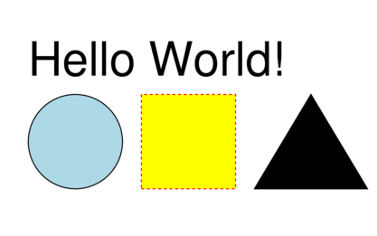
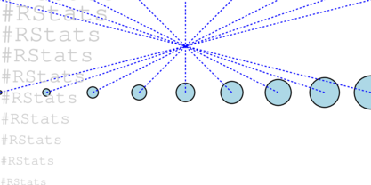

```{r, include = FALSE}
knitr::opts_chunk$set(
  collapse = FALSE,
  comment = "#>"
)
```

```{r setup}
library(minipdf)
```


# Hello World!


```{r}
doc <- create_pdf(width = 400, height = 250) |>
  pdf_circle(80, 100, 50, fill = 'lightblue', col = 'black') |>
  pdf_rect(150, 50, 100, 100, fill = 'yellow', col = 'red', lty = 2) |> 
  pdf_polygon(c(270, 390, 330), c(50, 50, 150)) |>
  pdf_text("Hello World!", x = 30, y = 170, fontsize = 50) 
```


```{r eval=interactive()}
write_pdf(doc, "figures/helloworld.pdf")
```


```{r echo=FALSE, eval=interactive()}
system("magick -density 300 figures/helloworld.pdf -resize 25% -depth 8 figures/helloworld.png")
```


```{r echo=FALSE}

```


## Vectorised arguments

Most coordinate arguments can be vectors - this means multiple objects
can be generated with a single call.

Note that all objects created in this way share a single graphics state i.e. 
they'll all be the same color etc.

```{r}
doc <- create_pdf(width = 400, height = 200) |>
  pdf_circle(
    x = seq(0, 400, length.out = 9), 
    y = 100, 
    r = 2 * (1:9), 
    col = 'black', lwd = 1, fill = 'lightblue'
  ) |> 
  pdf_line(
    x1 = seq(0, 400, length.out = 9), 
    y1 = 100, 
    x2 = seq(400, 0, length.out = 9), 
    y2 = 200, 
    lty = 3, col = 'blue'
  ) |> 
  pdf_text(
    "#RStats", 
    x = 0, 
    y = seq(0, 200, length.out = 10),
    fill       = 'grey80',
    fontfamily = 'mono', 
    fontsize   = seq(12, 30, length.out = 10)
  ) 
```


```{r eval=interactive()}
write_pdf(doc, "figures/simple.pdf")
```


```{r echo=FALSE, eval=interactive()}
system("magick -density 300 figures/simple.pdf -resize 25% -depth 8 figures/simple.png")
```


```{r echo=FALSE}

```


## Multiple circles with per-element graphical parameters

```{r echo=FALSE}
set.seed(1)
```


```{r}
doc <- create_pdf(height = 400, width = 600)

N <- 400
xs <- sample(600, N, TRUE)
ys <- sample(400, N, TRUE)
rs <- sample(100, N, TRUE)
cs <- sample(colors(), N, TRUE)

for (i in seq_len(N)) {
  doc <- pdf_circle(doc, xs[i], ys[i], rs[i], col = NA, fill = cs[i], alpha = 0.2)
}

doc <- pdf_translate(doc, 50, 0)

doc <- pdf_text(doc, "#RStats", 10, 150, fontsize = 120, mode = 1, col = 'black', 
                fontface = 'bold.italic', lwd = 5)
```


```{r eval=interactive()}
write_pdf(doc, "figures/example1.pdf")
```


```{r echo=FALSE, eval=interactive()}
system("magick -density 300 figures/example1.pdf -resize 25% -depth 8 figures/example1.png")
```


```{r echo=FALSE}

```


## Beziers

```{r}
N <- 100

doc <- create_pdf() |>
  pdf_bezier(
    x0 = seq(0, 400, length.out = N), 
    y0 = 10, 
    x1 = 25, 
    y1 = seq(20, 300, length.out = N), 
    x2 = seq(100, 80, length.out = N), 
    y2 = 250, 
    x3 = 400, 
    y3 = seq(400, 300, length.out = N), 
    alpha = 0.2
  )
```


```{r eval=interactive()}
write_pdf(doc, "figures/beziers.pdf")
```

```{r echo=FALSE, eval=interactive()}
system("magick -density 300 figures/beziers.pdf -resize 25% -depth 8 figures/beziers.png")
```


```{r echo=FALSE}

```


